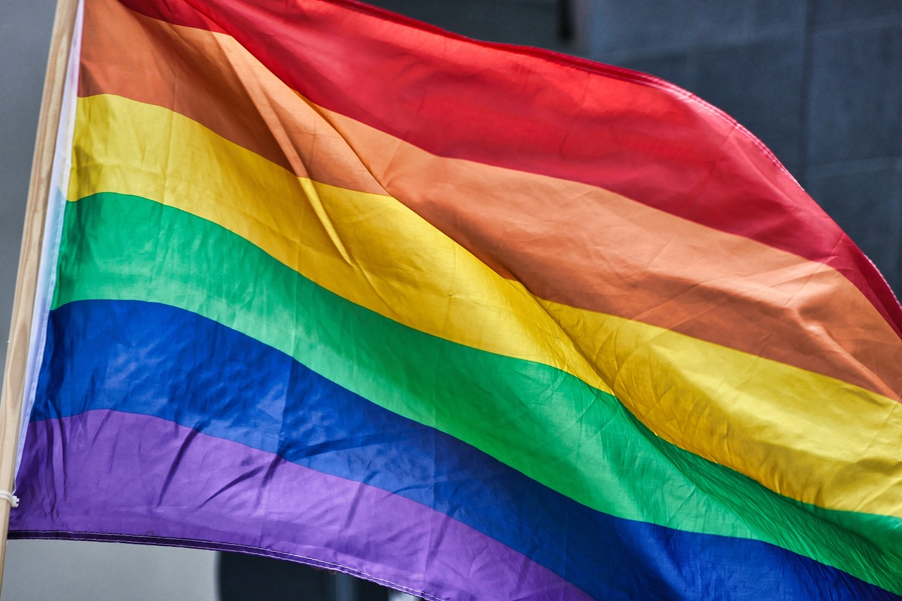

# About

We are a grassroots community and mutual aid organization designed by queer people, for queer people, who are new to the Twin Cities and Minnesota or are considering moving here. (Allies and locals are welcome!). Our goal is to help people from diverse backgrounds make friends, find community, give and receive support, share experiences, and explore the Twin Cities and greater Minnesota together.

Explore resources to help you settle into Minnesota’s LGBT-friendly community!

- [Why Minnesota](why.md)
- [Resources](resources.md)
- [Testimonials](testimonials.md)
- [Volunteer](volunteer.md)

